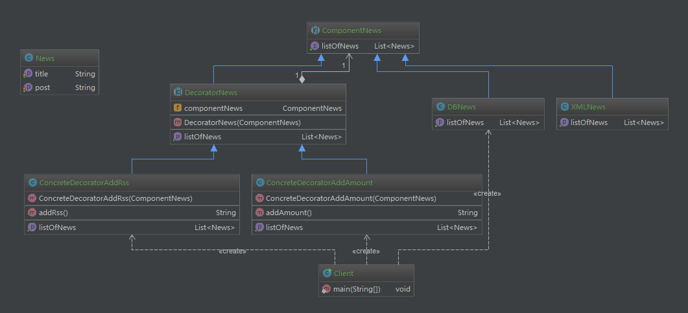

# 装饰者模式

## UML类图

## 概述
动态地将责任附加到对象上.若要扩展功能,装饰者提供了比继承更有弹性的替代方案。

装饰者和被装饰者之间必须是一样的类型,也就是要有共同的超类。在这里应用继承并不是实现方法的复制,而是实现类型的匹配。因为装饰者和被装饰者是同一个类型,因此装饰者可以取代被装饰者,这样就使被装饰者拥有了装饰者独有的行为。根据装饰者模式的理念,我们可以在任何时候,实现新的装饰者增加新的行为。如果是用继承,每当需要增加新的行为时,就要修改原程序了。

用装饰者实例化组件时,将增加代码的复杂度,一旦应用了装饰者模式,不只需要实例化组件,还要把组件包装进装饰者,而这样的装饰者有多少个是不确定的。这里可以应用工厂模式来实例化组件来简化操作。