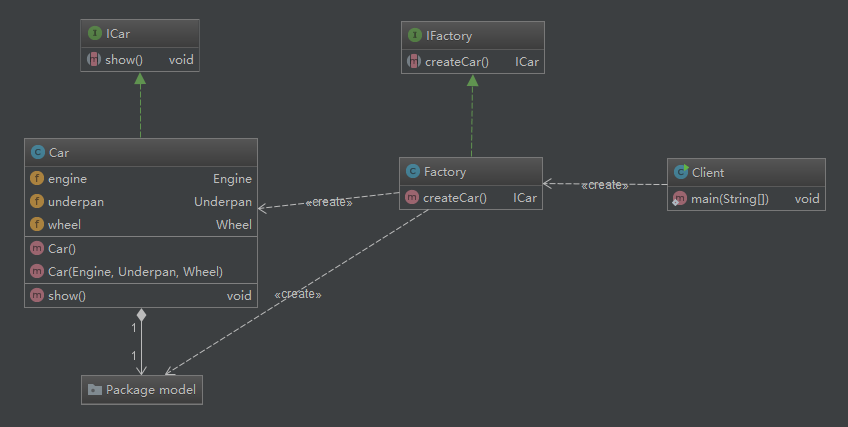

# 工厂方法模型

## UML类图

## 示例

调用者想要生产一部汽车的流程，根据最少知道原则，调用者不需要知道汽车是怎么生成的，由哪些零部件组成的，调用者关心的是汽车是什么样的，汽车本身有哪些属性和方法。

汽车本身是由发动机、底盘、轮胎等等零件组成，使用零件组装汽车是有一整套的逻辑的，而这个产生的过程（也就是生成汽车对象），可以使用工厂来实现，这样调用者只需要跟工厂依赖，获取汽车即可。

## 代码结构

1. 抽象架构，定义汽车接口（ICar）

2. 需要一个工厂接口（IFactory），内含一个返回值为汽车接口的创建方法，目的是组装汽车后给外部调用。

3. 实现ICar接口的Car类，在此书写汽车相关的业务逻辑。

4. 实现IFactory的Factory类，在此书写汽车生成的业务逻辑。

5. 上下文调用时，首先创建实例化一个工厂对象，用此对象的生产汽车的方法生产一部汽车，然后就可以使用该汽车对象，进而调用其内部的方法。

## 总结

从架构流程上看，调用类没有与任何汽车的零部件产生依赖，完全不知道汽车是如何组装的，只依赖了工厂类（Factory）和汽车类（Car）。

所以说，工厂方法模型是属于“创建型”工厂模式中很常用，并且解耦非常有效的模式，适合创建非常复杂的对象时使用。